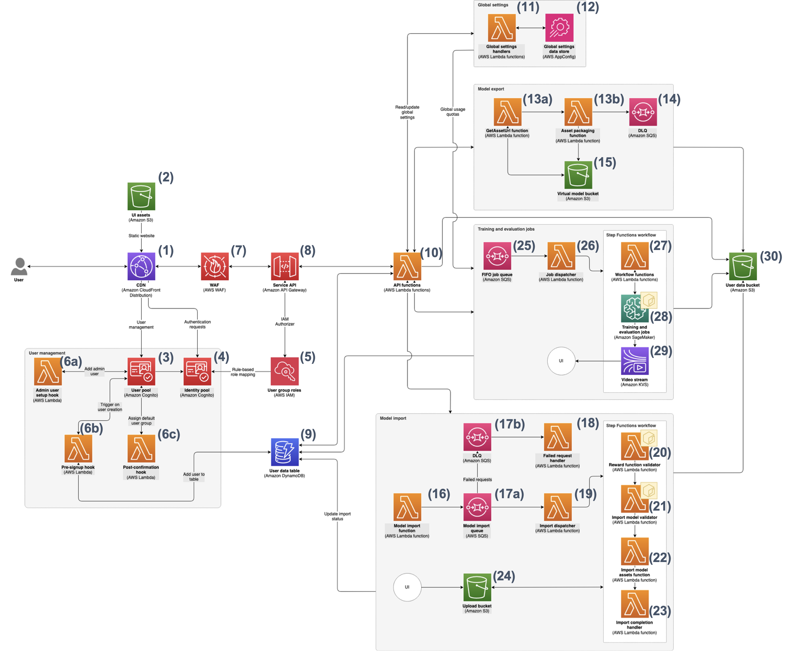

# DeepRacer on AWS

## Overview

DeepRacer on AWS is a solution that allows you to train and evaluate reinforcement learning models in a three-dimensional simulated autonomous-driving environment. The trained model can then be downloaded to a AWS DeepRacer vehicle (a 1/18th scale RC car capable of running inference on a trained AWS DeepRacer model for autonomous driving) so it can drive in a physical environment. You can also submit your model to a virtual race and have its performance ranked against other models in a virtual leaderboard.

## Architecture

Deploying this solution with the default parameters deploys the following components in your AWS account.



### Components

1. A user accesses the DeepRacer on AWS user interface through an [Amazon CloudFront](https://aws.amazon.com/cloudfront/) distribution, which delivers static web assets from the UI assets bucket and video streams from simulations.

1. The user interface assets are hosted in an [Amazon S3](https://aws.amazon.com/s3/) bucket that stores the static web assets comprising the user interface.

1. An [Amazon Cognito](https://aws.amazon.com/cognito/) user pool manages users and user group membership.

1. An [Amazon Cognito](https://aws.amazon.com/cognito/) identity pool manages federation and authorization.

1. [AWS IAM](https://aws.amazon.com/iam/) user group roles define permissions and levels-of-access for each type of user in the system, used for access control and authorization.

1. [AWS Lambda](https://aws.amazon.com/lambda/) registration hooks execute pre- and post-registration actions including adding new users to the default user group, handling admin profile creation, and more.

1. [AWS WAF](https://aws.amazon.com/waf/) provides intelligent protection for the API against common attack vectors and allows customers to define custom rules based on individual use cases and usage patterns.

1. [Amazon API Gateway](https://aws.amazon.com/api-gateway/) routes API requests to their appropriate handler using a defined Smithy model.

1. An [AWS DynamoDB](https://aws.amazon.com/dynamodb/) table serves as a single table for storing and managing profiles, training jobs, models, evaluation jobs, submissions, and leaderboards.

1. [AWS Lambda](https://aws.amazon.com/lambda/) functions are triggered in response to requests routed from the API and are responsible for CRUD operations, dispatching training/evaluation jobs, and more.

1. A global settings handler [AWS Lambda](https://aws.amazon.com/lambda/) function reads and writes application-level settings to the configuration.

1. [AWS AppConfig](https://aws.amazon.com/systems-manager/features/appconfig/) hosted configuration stores application-level settings, such as usage quotas.

1. [AWS Lambda](https://aws.amazon.com/lambda/) model export functions retrieve the asset URL and package assets for use in exporting models from the system.

1. An [Amazon SQS](https://aws.amazon.com/sqs/) dead-letter queue catches failed export jobs thrown from the asset packaging function.

1. A virtual model bucket ([Amazon S3](https://aws.amazon.com/s3/)) stores exported models and provides access to them via pre-signed URL.

1. A model import [AWS Lambda](https://aws.amazon.com/lambda/) function receives requests to import a model onto the system and creates a new import job.

1. [Amazon SQS](https://aws.amazon.com/sqs/) model import queues (queue and DLQ) receive jobs from the model import function and hold them until they are accepted by the dispatcher.

1. A failed request handler [AWS Lambda](https://aws.amazon.com/lambda/) function handles failed requests and updates their status to reflect their current state.

1. An import dispatcher [AWS Lambda](https://aws.amazon.com/lambda/) function takes a job from the queue and dispatches it to the workflow.

1. A reward function validator [AWS Lambda](https://aws.amazon.com/lambda/) function checks the reward function and validates/sanitizes the customer-provided code before it is saved to the system.

1. An import model validator [AWS Lambda](https://aws.amazon.com/lambda/) function checks and validates the imported model before it is saved to the system.

1. An import model assets [AWS Lambda](https://aws.amazon.com/lambda/) function brings in model assets from the upload bucket.

1. An import completion handler [AWS Lambda](https://aws.amazon.com/lambda/) function handles status updates when a job is completed successfully.

1. An upload bucket ([Amazon S3](https://aws.amazon.com/s3/)) stores uploaded (but not yet imported) assets from the user.

1. An [Amazon SQS](https://aws.amazon.com/sqs/) FIFO queue receives requests for training and evaluation jobs and stores them in FIFO order.

1. A job dispatcher [AWS Lambda](https://aws.amazon.com/lambda/) function picks a job off the top of the FIFO queue and dispatches it to the workflow.

1. [AWS Lambda](https://aws.amazon.com/lambda/) workflow functions handle setting up the job, setting status, and other workflow tasks.

1. [Amazon SageMaker](https://aws.amazon.com/sagemaker/) performs the actual training and evaluation of the model using the reward function and hyperparameters provided.

1. [Amazon Kinesis Video Streams](https://aws.amazon.com/kinesis/video-streams/) handles presenting the simulation video to the user from the SageMaker training job.

1. A user data bucket ([Amazon S3](https://aws.amazon.com/s3/)) stores all user data including trained models, evaluation results, and other assets generated during the DeepRacer workflow.

## Package layout

- The source code for the **DeepRacer on AWS** is located in `./source`.

## Repository structure

_DeepRacer on AWS_ is structured as monorepo. See below for package layouts and intended contents.

```
┣ 📦 deployment
┃  ┗ 📂cdk-solution-helper                  Lightweight helper that cleans-up synthesized templates from the CDK
┗ 📦 source
   ┣ 📂apps                                 Applications - Code not imported/consumed outside of its own package
   ┃  ┣ 📂infra                             CDK application
   ┃  ┃  ┣ 📂bin
   ┃  ┃  ┃  ┗ 📜deepRacerIndy.ts            Main CDK app definition
   ┃  ┃  ┗ 📂lib
   ┃  ┃     ┣ 📂constructs                  CDK constructs
   ┃  ┃     ┗ 📂stacks                      CDK stacks
   ┃  ┗ 📂website                           Website application
   ┃     ┗ 📂src
   ┃        ┣ 📂assets                      Static assets (ie. images)
   ┃        ┣ 📂components                  React components re-used throughout the website
   ┃        ┣ 📂pages                       React components for individual website pages
   ┃        ┗ 📂utils                       Utils specific to the website application
   ┗ 📂libs                                 Libraries - Code consumed/imported by apps or other libraries
      ┣ 📂config                            Config package - App-wide configuration
      ┃  ┗ 📂src
      ┃     ┣ 📂configs                     Domain specific configurations
      ┃     ┣ 📂defaults                    Config default values
      ┃     ┗ 📂types                       Config definitions
      ┣ 📂database                          Database package - Database related implementation
      ┃  ┗ 📂src
      ┃     ┣ 📂constants                   Database constants
      ┃     ┣ 📂dao                         DAO implementations
      ┃     ┣ 📂entities                    ElectroDB entities
      ┃     ┗ 📂utils                       Database specific utils
      ┣ 📂lambda                            Lambda Package - lambda handlers
      ┃  ┗ 📂src
      ┃     ┣ 📂api                         API lambda code
      ┃     ┃  ┣ 📂handlers                 API lambda handler implementations
      ┃     ┃  ┣ 📂types                    API TypeScript types
      ┃     ┃  ┗ 📂utils                    API lambda utils
      ┃     ┣ 📂cognito                     Cognito lambda code
      ┃     ┗ 📂workflow                    Workflow lambda code
      ┣ 📂model                             Model package - API Smithy model
      ┃  ┗ 📂src
      ┃     ┗ 📂main
      ┃        ┗ 📂smithy
      ┃           ┣ 📂operations            Smithy definitions for API operations
      ┃           ┣ 📂types                 Smithy definitions for API types
      ┃           ┗ 📜main.smithy           Smithy API definition
      ┣ 📂typescript-client                 Auto-generated from model - API TypeScript client for website to consume
      ┣ 📂typescript-server-client          Auto-generated from model - API TypeScript client for API lambdas to consume
      ┗ 📂utils                             Utils package - App-wide utils
```

## Deployment

You can launch this solution with one click from the solution home page:

- [DeepRacer on AWS](https://aws.amazon.com/solutions/implementations/deepracer-on-aws)

> **Please ensure you test the templates before updating any production deployments.**

## Creating a custom build

To customize the solution, follow the steps below:

### Prerequisites

- [AWS Command Line Interface](https://aws.amazon.com/cli/)
- Java 17
- Node v20+
- pnpm package manager

#### Install Java

Follow the instructions for your platform [here](https://docs.aws.amazon.com/corretto/latest/corretto-17-ug/what-is-corretto-17.html).

#### Install Node

It is recommended to manage node installations with a node version manager, such as [nvm](https://github.com/nvm-sh/nvm).

##### Install nvm

Run the nvm install script:

```
curl -o- https://raw.githubusercontent.com/nvm-sh/nvm/v0.40.0/install.sh | bash
```

##### Install Node v22

Install Node v22 using nvm:

```
nvm install 22
```

Select Node v22 as the version to use:

```
nvm use 22
```

Confirm that Node v22 is being used:

```
node --version
```

#### Install pnpm

[pnpm](https://pnpm.io/) is a javascript package manager that is faster and more efficient than npm.

Since v16.13, Node.js is shipping Corepack for managing package managers. This is an experimental feature, so you need to enable it by running:

```
corepack enable pnpm
```

#### Install Nx globally (optional)

Nx can be installed globally to remove the need to prefix nx commands with "pnpm" by running:

```
pnpm i -g nx
```

If you go this route, you can remove "pnpm" from any commands that run nx.

For example:

```
pnpm nx test database
```

becomes

```
nx test database
```

### Download or clone this repo

```
git clone https://github.com/aws-solutions/deepracer-on-aws
```

### Install dependencies

Install package dependencies by running the following from the [monorepo root](./) (_source_ folder):

```
pnpm install
```

This will install `package.json` dependencies for all apps and libs in the monorepo, as well as shared dev dependencies from `package.json` in the monorepo root.

### After introducing changes, run the unit tests to make sure the customizations don't break existing functionality

```
cd ./deployment
chmod +x ./run-unit-tests.sh
./run-unit-tests.sh
```

### Build and deploy the solution using the accompanying build scripts

Define the following environment variables in your console session:

```
REGIONAL_ARTIFACT_BUCKET=my-bucket-name      # S3 bucket name prefix where customized regional code will reside
GLOBAL_ARTIFACT_BUCKET=my-bucket-name        # S3 bucket name where customized global code will reside
SOLUTION_NAME=my-solution-name               # customized solution name
VERSION=my-version                           # version number for the customized code
```

> In order to compile the solution, the _build-s3_ will install the AWS CDK.

```
cd ./deployment
chmod +x ./build-s3-dist.sh
./build-s3-dist.sh $REGIONAL_ARTIFACT_BUCKET $SOLUTION_NAME $VERSION $GLOBAL_ARTIFACT_BUCKET
```

> When creating the bucket for solution artifacts it is recommended to

- Use randomized names as part of your bucket naming strategy.
- Ensure buckets are not public.
- Verify bucket ownership prior to uploading templates or code artifacts.

> **Note**: The created bucket for regional artifacts must include the region in the bucket name (for example, _mybucket-name-**us-east-1**_).

```
aws s3 sync ./global-s3-assets s3://$GLOBAL_ARTIFACT_BUCKET/$SOLUTION_NAME/$VERSION --acl bucket-owner-full-control
aws s3 sync ./regional-s3-assets s3://$REGIONAL_ARTIFACT_BUCKET-us-east-1/$SOLUTION_NAME/$VERSION --acl bucket-owner-full-control
```

#### Launch the CloudFormation template

- Get the link of the template uploaded to your Amazon S3 bucket (created as \$REGIONAL_ARTIFACT_BUCKET in the previous step)
- Deploy the solution to your account by launching a new AWS CloudFormation stack

### Build and deploy the solution using CDK deploy

#### Set environment variables

1. Provide a valid email address as the value for the ADMIN_EMAIL environment variable. This will be used to set up the initial admin profile.

```
export ADMIN_EMAIL='user@example.com'
```

2. If you are deploying more than one instance of DeepRacer on AWS into the same account, provide a unique value for the NAMESPACE environment variable. This will help with labelling and separating the resources created by each deployment.

```
export NAMESPACE='deepracer-1'
```

If you want to use a public image for the reward validation function (or private image with appropriate permissions)

```
export  PUBLIC_ECR_REGISTRY=${AWS_ACCOUNT}.dkr.ecr.${AWS_REGION}.amazonaws.com
```

#### Configuration

The solution uses CDK context values for container image configuration. These are defined in `source/apps/infra/cdk.json` and can be overridden during deployment:

**Default context values:**

- `PUBLIC_ECR_REGISTRY`: "public.ecr.aws/aws-solutions"
- `MODEL_VALIDATION_REPO_NAME`: "deepracer-on-aws-model-validation"
- `REWARD_VALIDATION_REPO_NAME`: "deepracer-on-aws-reward-function-validation"
- `SIMAPP_REPO_NAME`: "deepracer-on-aws-simapp"

**Override context values during deployment:**

```
pnpm nx deploy infra --context PUBLIC_ECR_REGISTRY=my-registry.com --context PUBLIC_ECR_REGISTRY=<PRIVATE_ECR_REPO>
```

#### Bootstrap CDK (if not already done)

If this is your first time using CDK in your AWS account and region, you need to bootstrap it:

```
cdk bootstrap aws://<account-id>/<region>
```

This creates the necessary resources for CDK deployments in your account.

#### Build

Run the build command from the _source_ directory

```
pnpm build
```

#### Deploy

Deploy the infrastructure by running the following from the [monorepo root](./) (_source_ folder).

```
pnpm nx deploy infra
```

## Collection of Operational Metrics

This solution sends operational metrics to AWS (the “Data”) about the use of this solution. We use this Data to better understand how customers use this solution and related services and products. AWS’s collection of this Data is subject to the [AWS Privacy Notice](https://aws.amazon.com/privacy/).

---

Copyright Amazon.com, Inc. or its affiliates. All Rights Reserved.
