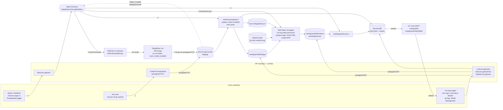
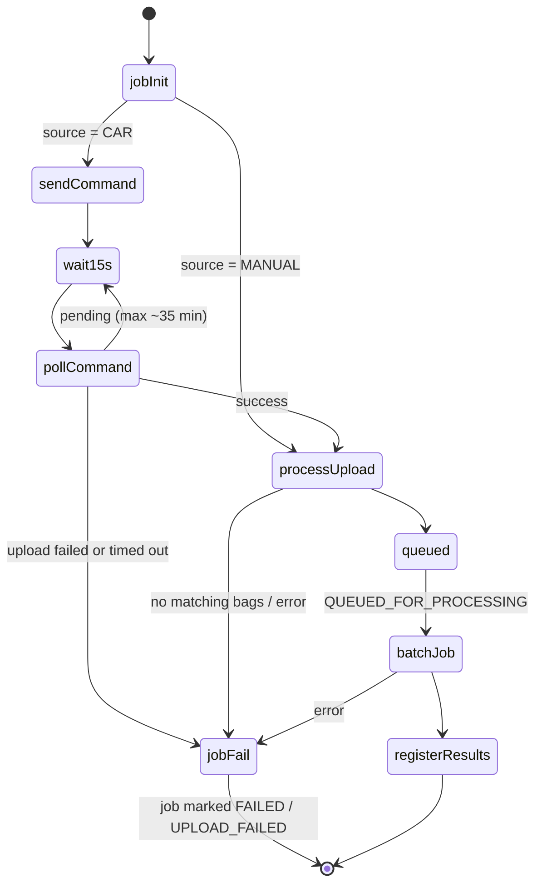

# Runbook: Car Logs

Operational guide for collecting ROS bag logs from cars (or from a manual upload) and turning them
into videos. Covers the flow, access rules, retention, cost and troubleshooting.

## Data flow

The workflow state machine:

## How it works

1. **Start.** A facilitator or admin starts a fetch for a car (`StartCarLogFetch`, from the Devices
   page or the Timekeeping toggle), or a user uploads a `.tar.gz` of bag folders (`CreateCarLogUpload`
   returns a presigned PUT URL for `staging/manual/<jobId>.tar.gz`).
2. **Car fetch.** The `<namespace>-DeepRacerCarLogWorkflow` state machine sends an SSM
   `AWS-RunShellScript` command to the car. The script packs the matching bag folders and uploads them
   to a one-time presigned URL under `staging/car/<jobId>.tar.gz`. The state machine polls the command
   every 15 seconds for up to about 35 minutes (the command itself times out after 30 minutes).
3. **Manual upload.** An S3 `Object Created` event under `staging/manual/` starts the same workflow.
4. **Processing.** `JobProcessUpload` unpacks the archive and keeps only bag folders named
   `<racerName>_<modelName>_<modelId>[-YYYYMMDD-HHMMSS]` whose `modelId` is a model known to the
   solution. The bags are stored under `carlogs/<profileId>/bags/` of the device logs bucket and
   registered as assets, and `job-configs/<jobId>.json` is written.
5. **Video.** An AWS Batch (Fargate) job runs the `car-log-video-processor` image, which analyses
   each bag (optionally with Grad-CAM from the model), renders videos and writes
   `carlogs/<profileId>/videos/` plus `results/<jobId>.json`. `JobRegisterResults` registers the
   videos as assets.
6. **Notifications.** Job and asset changes are pushed to the UI over IoT
   (`deepracer/<namespace>/carlogs/jobs` and `.../carlogs/assets/<profileId>`). The payloads only carry
   ids and statuses.

A bag folder is matched to its owner by the trailing `modelId`. Models that were already on a car
before this naming was introduced do not match and are ignored.

## Who can do what

| Role | Assets | Fetch jobs | Delete | Start fetch / upload |
|---|---|---|---|---|
| racer, registration manager | own only | none | own | upload |
| facilitator, admin | all (Model Management), own (Learning & Models) | all | all | yes |
| commentator | all videos (no other racers' raw bags); own assets in full | none | own | no |

Every role finds its own logs under **Learning & Models → Car logs** (`/car-logs`). Admins and
facilitators also get **Model Management → Car logs** (`/admin/car-logs`) with every racer's logs, the
Racer column, uploads and the processing tab.

## Retention

Bags and videos are kept for 90 days (the bucket lifecycle rule and the asset TTL). Uploaded archives
(`staging/`) and download archives (`downloads/`) expire after 1 day, job inputs and results
(`job-configs/`, `results/`) after 7 days.

## Cost

Each job runs up to 8 vCPU / 16 GiB with 100 GiB of ephemeral storage for at most 2 hours; the
compute environment is capped at 32 vCPU. Adjust the constants in
`source/apps/infra/lib/constructs/car-logs/carLogsBatch.ts` if needed.

## Alarms and where to look

- `<namespace>-CarLogsLambdaErrorsAlarm`: any car-log Lambda reported errors. Check the `carLogs` and
  workflow log groups.
- Car log workflow executions failed or timed out: open the state machine in the Step Functions
  console. Failures that are the user's to fix (no matching bags, a car that could not upload) end the
  execution as a success and are shown on the job in the UI.
- Video processor logs: the log group of the Batch job (`car-log-video-processor` stream prefix).

## Troubleshooting

| Symptom | Likely cause and action |
|---|---|
| Job `UPLOAD_FAILED` | The car is offline, has no matching logs or could not reach S3. The job message carries the tail of the script's error output. Check that the car is `ONLINE` and `loggingCapable`. |
| "No matching rosbags" | No bag folder name ends with a known `modelId`. Check the folder names on the car (`<racerName>_<modelName>_<modelId>`). |
| Job `FAILED` after upload | See the Batch log group. Typical causes are an out-of-memory job (raise `JOB_MEMORY_MIB`), a model that does not load for Grad-CAM (the bag is then skipped and listed as a failure), or a damaged bag. |
| Manual upload does not start | The key must be `staging/manual/<jobId>.tar.gz` for a job created with `CreateCarLogUpload`, and the job must still be waiting for the upload. |

## Open compliance items

- The Amazon Ember fonts, logo and background image used for the video overlays are copied from the
  DREM solution. Confirm that redistribution inside the public container image is allowed.
- `larsll/deepracer-viz` does not publish a licence file. Confirm the licence with its maintainer
  before releasing the image. Both `larsll` repositories are pinned to commit SHAs in the Dockerfile.
- The image installs `libx264` (GPL) through apt; confirm that this is acceptable for distribution.
